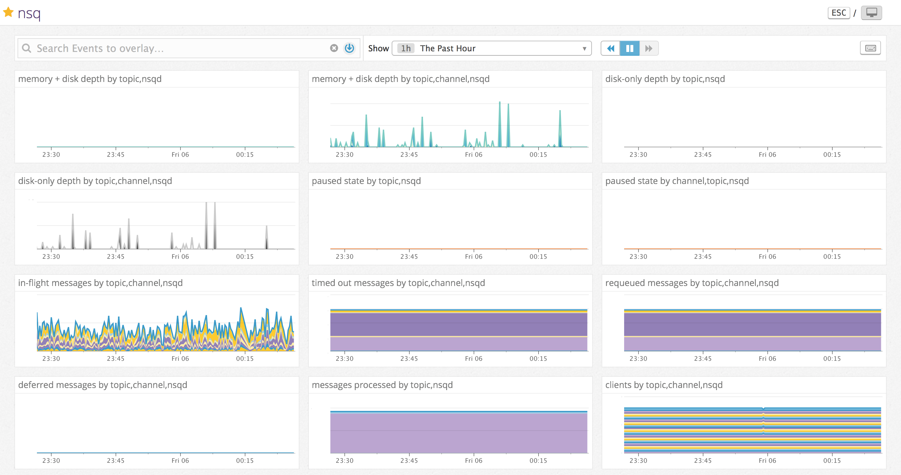

# nsq-dogstatsd

## Status

[![build status][travis-image]][travis-url]

## Introduction

`nsq-dogstatsd` is an utility that lets you graph [nsq](http://nsq.io) stats on [Datadog](https://www.datadoghq.com) by sending custom metrics via [DogStatsD](http://docs.datadoghq.com/guides/dogstatsd/), allowing you to create beautiful dashboards with powerful monitors.



_Figure 1\. An example of a custom Datadog nsq dashboard with sample data._

The built-in statsd integration of nsqd pushes metrics using the common statsd paths (e.g. `nsq.<nsqd_host>_<nsqd_port>.topic.<topic_name>.<metric_name>`). While this is the expected format for a standard statsd integration, DogStatsD augments the statsd protocol with a few extensions for taking advantage of special Datadog features. Tags are one of those killer features.

By pushing custom metrics to Datadog, a completely different range of features opens up. Instead of multiple specific metrics, one can send a single metric (e.g. `nsq.channel.backend_depth`) and associate it with multiple topics and channels via tags. Monitoring becomes delightful and tracking issues such as high `backend_depth` values across any nsqd node is trivial.

## Installation

DogStatsD (Datadog's own statsd-compatible daemon) is bundled with the Datadog Agent but can be run separately (in what is known as _standalone_ mode). If Datadog Agent is already running on some host, you don't need to do anything else - just point `nsq_to_dogstatsd` there.

If you want to experiment with DogStatsD in standalone mode, the simplest way is to run it inside a volatile Docker container. Be sure to add your API key and expose port `8125/udp` which is the listening port for DogStatsD:

```sh
docker run --rm --name dogstatsd -h `hostname` -p 8125:8125/udp -e API_KEY=<api-key> datadog/docker-dd-agent:latest-dogstatsd
```

Then run `nsq_to_dogstatsd` either by running it via Docker or installing it according to your OS and architecture.

Using Docker:

```sh
docker run --rm ruimarinho/nsq-dogstatsd <args>
```

Using cURL:

```sh
curl -s https://github.com/ruimarinho/nsq-dogstatsd/blob/master/install.sh | sh
```

## Usage

Let's assume that you either have the Datadog Agent or a standalone DogStatsD server running on a local machine (`127.0.0.1`) on its default port (`8125/udp`).

```
❯ nsq_to_dogstatsd
Usage of nsq_to_dogstatsd:

  -dogstatsd-address string
        <address>:<port> to connect to dogstatsd (default "127.0.0.1:8125")
  -interval duration
        interval for collecting metrics (default "none")
  -lookupd-http-address value
        <address>:<port> of nsqlookupd to query nodes for
  -namespace string
        namespace for metrics (default "nsq")
  -nsqd-http-address value
        <address>:<port> of nsqd node to query stats for
  -tag value
        add global tags (can be specified multiple times)
```

If both `lookupd-http-address` and `nsqd-http-address` are provided, all nsqd nodes will be used - those provided by `nsqlookupd` in addition to those defined separately by the `nsqd-http-address` flag. Duplicate nsqd nodes will be ignored.

The following example connects to a local `nsqlookupd` instance running on `127.0.0.1:4161` and uses a polling interval of 5 seconds to query for statistics while applying a global tag of `environment:development`: 

```sh
❯ docker run --rm ruimarinho/nsq-dogstatsd -lookupd-http-address 127.0.0.1:4161 -interval 5s -tag environment:development
```

Use the [Metrics > Summary](https://app.datadoghq.com/metric/summary) view of Datadog to check if your metrics are being sent correctly. It may take a few minutes for them to appear for the first time.

## Monitors

One of most powerful features of Datadog are its monitors. They allow you to monitor certain metrics for specific changes and alert you when those conditions are met. This is extremely useful to monitor nsq clusters and prevent potential issues.

Here's how you can can create a monitor:

1. **Define the metric**

  For instance, choose `nsq.channel.depth` and select avg by `channel`, `topic`, `node`.

  Check _Trigger a separate alert for each (multi alert)_.

2. **Set alert conditions**

  Select _Threshold Alert_:

- Trigger when the metric is: **above** the threshold **on average** during the last **5 minutes** for any **channel**, **topic**, **node**.
- Alert threshold: **100**

3. **Say what's happening**

- Subject: `nsq depth on channel {{channel.name}} ({{topic.name}}) is increasing on {{node.name}}`

4. **Notify your team**

  Choose whoever should be notified about potential monitor changes.

## License

MIT

[travis-image]: https://img.shields.io/travis/ruimarinho/nsq-dogstatsd.svg?style=flat-square
[travis-url]: https://travis-ci.org/ruimarinho/nsq-dogstatsd
